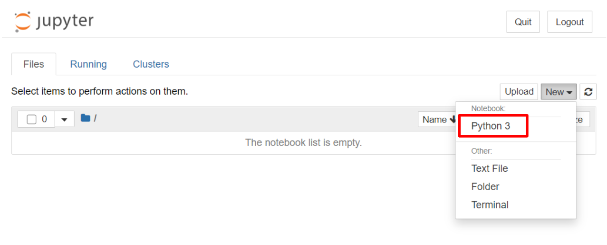
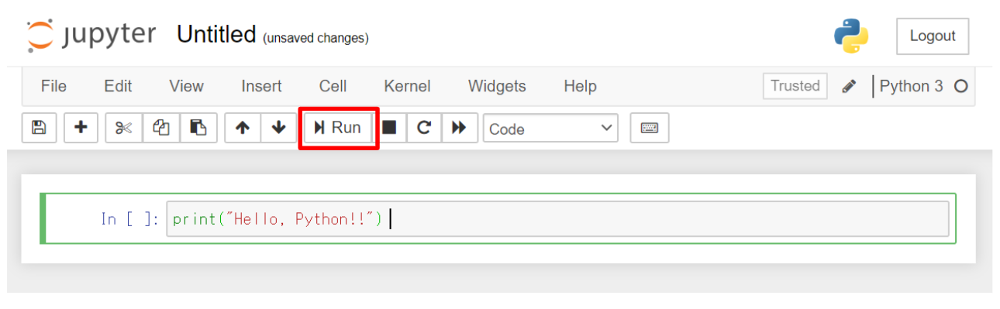
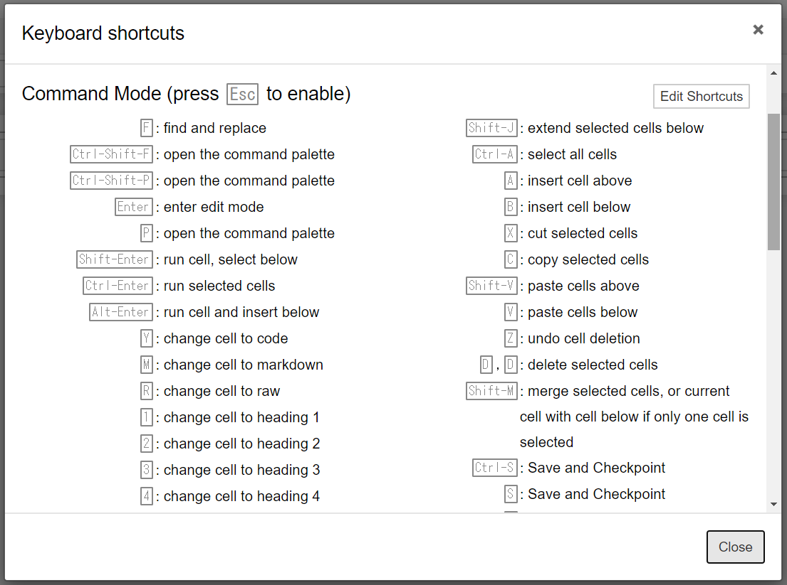
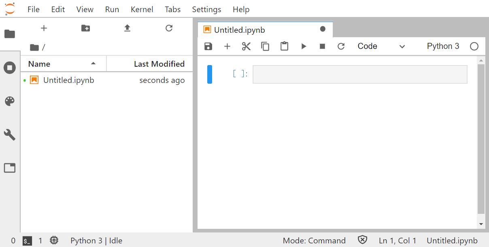

# そうだ、AI実装師になろう！

## 0. 環境構築

### 0-1. Anacondaの導入

Pythonを使ってAIを実装するために、まずはAnacondaをインストールしましょう。Anacondaは、Python本体に加えて、AI開発に必要なライブラリがまとめられたもの（ディストリビューション）です。

Anaconda（ダウンロードページ）
https://www.anaconda.com/products/individual

**【インストール手順】**
1. イントーラを起動する。
2. 基本的に [Next]ボタンまたは [I Agree]ボタンをクリックしていく。 ※環境変数のPATHに追加するのは非推奨らしい。
3. インストールが終わるのを待つ。
4. スタートメニュー -> Anaconda3 -> Anaconda Promptを起動して、`python --version`コマンドを実行し、`Python 3.7.x`と表示されればOK！

 

### 0-2. Jupyter Notebookの起動

Jupyter Notebookとは、ブラウザ上で動作するPython開発環境です。Anacondaに付属しています。Anaconda Prompt（Terminal）で `jupyter notebook` コマンドを実行すると、ローカルでサーバープログラムが起動し、ブラウザが起動します。 ノートブック（.ipynb）という形式でファイルを作成し、PythonコードやMarkdownを記述することができます。

**【起動方法】**
1. スタートメニュー -> Anaconda3 -> Anaconda Promptを起動する。
2. `jupyter notebook`コマンドを実行すると、ブラウザを起動する。

> コマンド実行時のカレントディレクトリが、Jupyter Notebook上のルートディレクトリになります。

> Ctrl + Cで、Jupyter Notebookを停止できます。

 

### 0-3. Jupyter Notebookの操作

画面右上の [New]ボタン -> Python3 をクリックすると、新しいノートブックを作成できます。

 

セルにPythonコードを入力し、[Run]ボタンをクリックすると、実行結果がセルの下に表示されます。

> Ctrl + Enterでも実行可能です。

> ノートブックの上部にタイトルがあり、クリックすることでタイトルが変更できます。デフォルトは「Untitled」になっています。

 

セル外をクリックするとコマンドモードに切り替わります。コマンドモードでHキーを押すと、ショートカットの一覧が確認できます。

  

便利なショートカットキー（コマンドモード）
| キー | 内容 |
|------|-----|
| A | 選択中のセルの上に新しいセルを追加する。 |
| B | 選択中のセルの下に新しいセルを追加する。 |
| D（2回連続） | 選択中のセルを削除する。 |
| M | 選択中のセルの入力タイプをMarkdownに変更する。 |
| Y | 選択中のセルの入力タイプをPythonコードに変更する。 |

 

### 0-4. （参考）Jupyter Lab

Jupyter Labは、Jupyter Notebookの後継として登場したPython開発環境です。大きな変更点は画面構成で、Jupyter Notebookでは別ページで表示されていたディレクトリ画面とPython実行画面が1つのページにまとめられています。

Anaconda Promptで `jupyter lab`コマンドを実行すると、Jupyter Labが起動します。

  

### 0-5. （参考）PyCharm

PyCharmは、JetBrains社が提供するPythonの統合開発環境（IDE）です。コード解析、グラフィカルなデバッガ、統合単体テスター、統合されたバージョン管理システム、Djangoを用いたWeb開発環境を提供しています。

https://www.jetbrains.com/ja-jp/pycharm/
